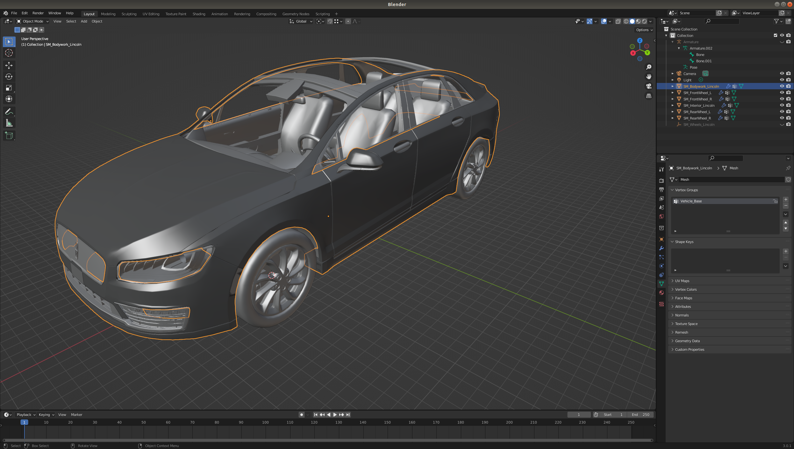
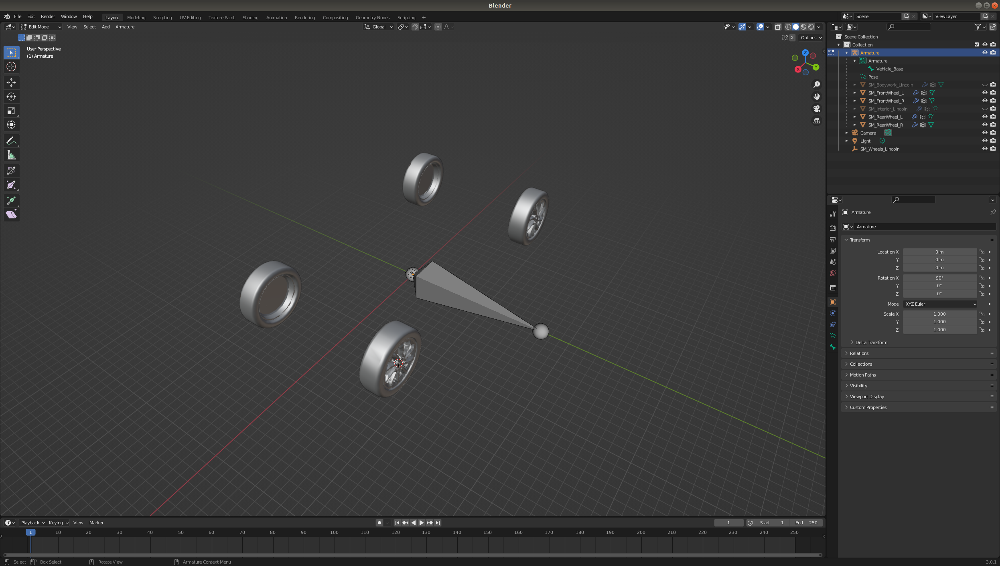
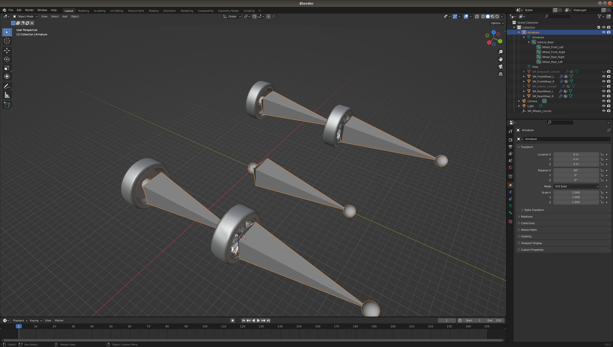
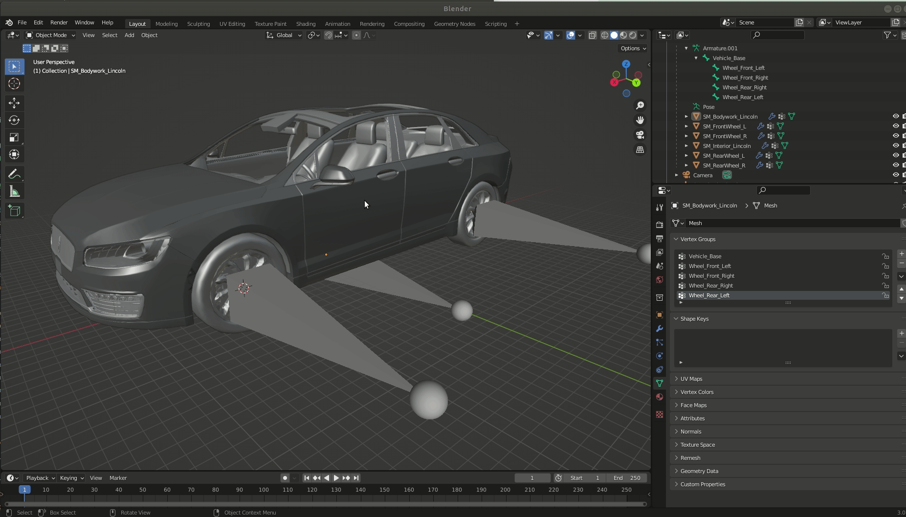
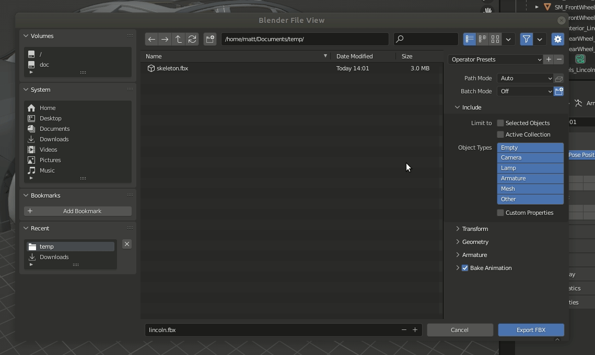
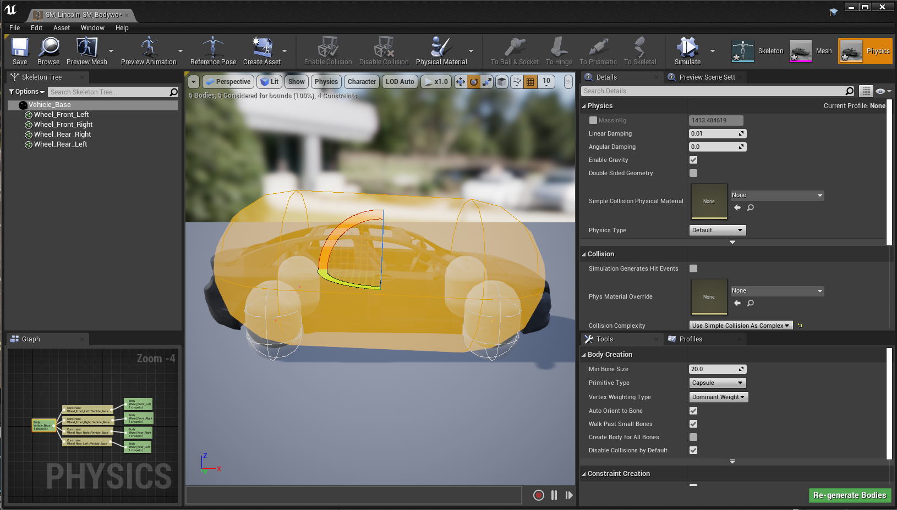
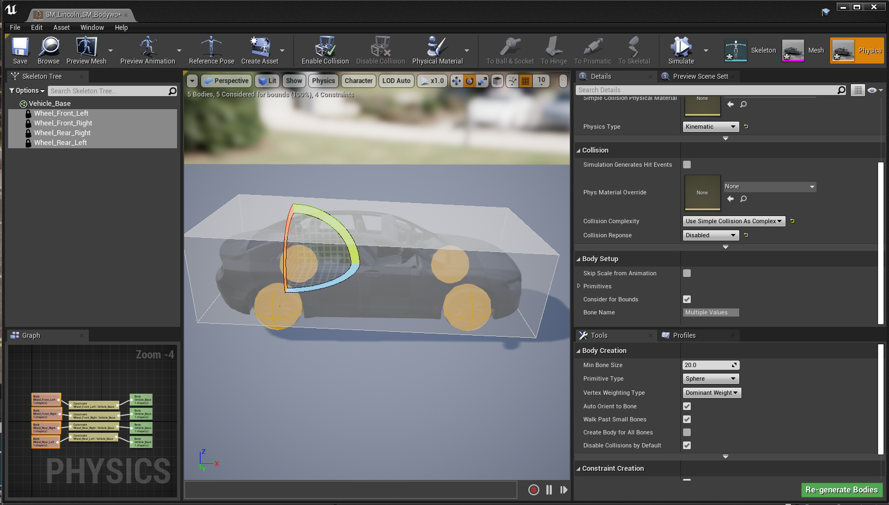
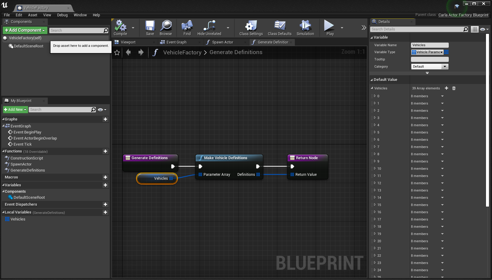

# Content authoring - vehicles

CARLA provides a comprehensive set of vehicles out of the box in the blueprint library. CARLA allows the user to expand upon this with custom vehicles for maximum extensibility. 

3D modelling of detailed vehicles is highly complex and requires a significant degree of skill. We therefore refer the reader to alternative sources of documentation on 3D modelling, since this is beyond the scope of this guide. There are, however, numerous sources of vehicle models in both free and proprietary online repositories. Hence the user has many options to turn to for creating custom vehicles for use in CARLA.

The key factors in preparing a custom vehicle for CARLA lie in rigging the vehicle armature and then importing into the Unreal Engine. We will cover these steps in the following guide.

## Rigging the vehicle using an armature

To look realistic within the simulation, the car needs to have rotating and wheels, the front pair of which can turn with steering inputs. Therefore to prepare a vehicle for CARLA, an armature needs to be rigged to the car to identify the wheels and allow their movement. 

### Import 

Import or model the vehicle model mesh in your 3D modelling application. In this guide we will use Blender 3D. Ensure that the wheels are seperable from the main body. Each wheel must be accessible as a distinct object. 



It is important to ensure that the vehicle faces in the positive X direction, so the hood and windshield should be facing towards positive X. The car should also be oriented such that the floor to roof direction is in the positive Z direction. The wheels should be just grazing the X-Y plane and the origin should be situated where you would expect the vehicle's center of mass to be in the X-Y plane (not in the Z plane though).

### Add an armature

Now add an armature to the center of the vehicle, ensure the object is properly centered, the root of the armature bone should be set at the origin. Switch to edit mode and rotate the arumature 90 around the x axis. 



Now select the armature and add 4 more bones. Each of these bones needs to be located such that the root of the bone coincides with the centre of the each wheel. This can be achieved by locating the 3D cursor at the center of each wheel in edit mode. Select one of the wheels in object mode, select a vertex, press A to select all vertices then `Shift+S` and select `Cursor to selected`. This will locate the cursor in the center of the wheel. Then, in object mode, select the armature, switch to edit mode, select a bone and choose `Selection to cursor`. Your bone will now coincide with the wheel. Rotate each bone such that it lines up with the base of the armature. 

For each wheel, it is recommended to name the bone accoring to the wheel it needs to be coupled to, this will help in identification later when you need to assign vertex groups to each bone. 



### Parenting 

Now select all the parts of the body and all 4 wheels using shift or control in the project outliner,  then control select the armature you have created (this order is important, it won't work if you select these in reverse order). Press `Ctrl+p` and select `With empty groups` to bind the mesh to the armature.  


Now you have parented the mesh to the armature, you now need to assign each wheel to its respective bone. Select a wheel either in the outliner or the editor. Switch to edit mode, and select all the vertices of the wheel (shortcut - `a`). 

### Assigning car parts to bones

Select the mesh tab of the properties (the green triangle). Inside the vertex groups tab of the mesh properties panel, you should now see the bones of your armature. Select the bone corresponding to the wheel you are editing and select `Assign`. Once you have rigged the wheels, rig all other parts of the vehicle to the base bone.



Once you have assigned all of the mesh parts to the armature you can test if it works by selecting the armature and moving to pose mode and moving the relevant bones. The vehicle base bone should move the whole vehicle, while the wheel bones should each move and rotate their respective wheels. Ensure to undo any posing you might do with `Ctrl+Z`.


### Export

Now we will export our rigged model into FBX format for import into Unreal Engine. Select `Export > FBX (.fbx)` from the File menu. In the **Object Types* section of the *Include* panel, shift select the *Armature* and *Mesh* options. 

In the *Transform* panel. Change *Forward* to *X Forward* and change *Up* to *Z Up*. This is important to ensure the vehicle is oriented correctly in the Unreal Engine. 

In the *Armature* section uncheck *Add Leaf Bones* and uncheck *Bake Animation*.



## Importing into unreal engine

Launch the Unreal Editor with the `make launch` command from the CARLA root directory (the one where you have built CARLA from source). Open a content browser, set up an appropriate directory and right click and select `Import to ....`. Choose the FBX file that you previously exported from Blender (or another 3D modelling application). Import with default settings. 

### Setting the physics asset

You will now have 3 things in your content browswer directory, the mesh, the skeleton and the physics asset. Double click on the physics asset to adjust it.



First, select the main body, in the *Details* menu on the right, change the *Linear Damping* to 0.0 in the *Physics* section, check *Simulation Generates Hit Events* in the *Collision* section and change the *Primitive Type* from *Capsule* to *Box* in the *Body Creation* section. Then press *Regenterate bodies*. The capsule will now change to a rectangular box. Then select the wheels. 

Now select the wheels (in the *Skeleton Tree* section on the left). Change *Linear Damping* to 0.0, set *Physics Type* to *Kinematic*, set *Collision Response* toe *Disabled* and select the *Primitive Type* as *Sphere*. Press *Re-generate Bodies* once more.



### Creating the animation

In the content browser directory where you have your new vehicle asset, right click and choose `Animation > Animation Blueprint`. In the popup that opens, search for *VehicleAnimInstance* in the *Parent Class* section and for the *Target Skeleton* search for the skeleton corresponding to your new vehicle, you should be able to see the name in your content browser. After selecting these two things press OK. This will create a new animation blueprint for your vehicle.


To simplify things, we can copy the animation from another vehicle. In a second content browser, open `Content > Carla > Static > Vehicles > 4Wheeled` and choose any vehicle. Open the animation blueprint of your chosen vehicle and then copy all nodes that are not the *Output pose* node from this into your new animation blueprint. Connect the nodes by dragging a new connection between the final node to the output node. Press compile and the animation blueprint is now set.


### Creating the blueprint

Navigate with your content browser into `Content > Carla > Blueprints > Vehicles > LincolnMKZ2017` or a similar vehicle. In here you will find a set of blueprints set up for the 4 wheels. Copy these into the directory containing your own vehicle and rename them to ensure you can distinguish them later.


Right click in the content browser directory where your new vehicle assets are and chose *Blueprint Class*. search in the *All Classes* menu for *BaseVehiclePawn* and choose this class. Name the blueprint and open it. Select *Mesh* in the *Components* tab on the left and then drag the vehicle mesh into the Mesh section on the right hand side.


In *Anim Class* search for the animation corresponding to your new vehicle that you set up in the previous step.

Next, select *Vehicle Movement* in the *Components* menu of the blueprint class and in the right *Details* menu navigate to the *Vehicle Setup* section. Now for each wheel, find the relevant wheel blueprint that you previously copied and renamed for the *Wheel Class* attribute. Do the same for each wheel. Compile and save.


Now navigate to `Content > Carla > Blueprints > Vehicles > VehicleFactory` and double click this to open the Vehicle Factory.

Select the *Vehicles* node and expand the *Vehicles* item in the *Default value* section on the right hand side.



Press the plus icon to add your new vehicle. Scroll down to the last entry and expand it, it should be empty. Name the make and model of your vehicle and under the class section find your blueprint class that you created in the previous section. Leave the number of wheels as 4 and put the generation as 2. Compile and save. Do a global save for safety and you are now..ready to run your vehicle in a simulation. 

Press play in the unreal toolbar to run the simulation. Once it is running, open a terminal and run the `manual_control.py` script with the filter option to specify your new vehicle model:

```sh
python manual_control.py --filter my_vehicle_make
```


As it is, the vehicle currently has no textures or colors applied, however, you can return to the vehicle mesh in the Unreal Editor and add these details at a later stage. 